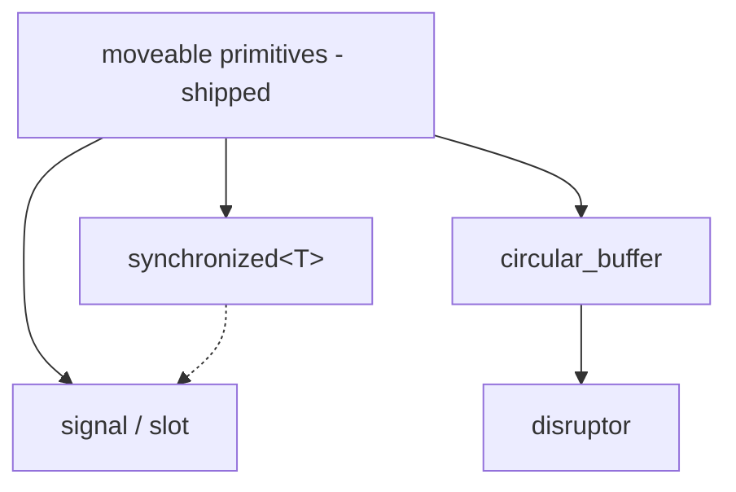

# Future directions

ts-moveables currently does one thing: it makes the immovable synchronisation primitives moveable under a single contract, so that concurrent classes get the rule of zero back. This document is the roadmap for what we build on top of that — and, just as importantly, what we deliberately do not build.

Everything here inherits the house rules:

- **The quiescent-move contract.** A move (or copy) either happens on a quiescent object or throws `std::runtime_error`. Moved-from objects stay valid.
- **Loud failure over undefined behaviour.** Where the standard library says UB, we throw.
- **No overhead where it matters.** Header-only, no dependencies, no allocation on hot paths, `static_assert`ed layout claims where we make them.
- **Simple and proven.** Plain `cassert` tests, ThreadSanitizer-clean across the CI matrix, and — for the performance-claiming components below — a benchmark harness, because a concurrency structure without numbers is a rumour.

Component dependency sketch:



---

## 1. `synchronized<T>` — the missing usage pattern ✅ shipped

**What.** A value of type `T` bonded to a `moveable_mutex`, where the *only* access path is through a closure that holds the lock:

```cpp
snicholls::synchronized<std::vector<int>> items;

items.with_lock([](auto& v) { v.push_back(42); });          // exclusive
auto n = items.with_lock([](const auto& v) { return v.size(); });
```

A `synchronized<T, moveable_shared_mutex>` variant gives `with_read_lock` / `with_write_lock`, and a condition-integrated `wait_until([](const T&){ ... })` builds on `moveable_condition_variable`. Copy copies the value under the lock; move follows the quiescent contract. Because the mutex inside is ours, `synchronized<T>` members compose and move like everything else in this library.

**Why it belongs here.** Today we give people moveable primitives; this gives them the safe *pattern*, and it structurally eliminates the classic misuse — locking, returning a reference, and touching it after unlock. There is no way to reach the `T` without holding the lock.

**Prior art, honestly.** `folly::Synchronized` is the best-in-class implementation but drags the whole folly dependency; `boost::synchronized_value` (Boost.Thread) is essentially unmaintained; `std::synchronized_value` is still a proposal (P0290). A header-only, dependency-free, *moveable* one has a real audience.

**Effort.** Small — roughly 150–200 lines plus tests. This ships first.

**Status: shipped** as `synchronized.hpp` — `synchronized<T, M>` (any BasicLockable `M`; shared-mutex `with_read_lock`; compile-time rejection of reference-returning closures; copy/move fully locked, so no quiescent contract is needed at all) plus `synchronized_waitable<T, M>` (`update` / `wait` / `wait_then` on `moveable_condition_variable_any`, with the waiter-checked move).

**Heterogeneous containers — resolved by composition, then shipped.** The question "should we build a thread-safe heterogeneous container?" has a pleasing answer: no *new* container is needed — `synchronized<T>` composed with the standard heterogeneous types covers it. That composition is now packaged in `synchronized_heterogeneous.hpp` as `synchronized_variant<Ts...>` (direct `visit`), `synchronized_tuple<Ts...>` (`get`/`set`/`apply`), `synchronized_any`, `synchronized_type_map` (one value per type — the blackboard/service-locator shape, with `with<U>(f)` as the race-free read-modify-write path), and `synchronized_bag` (open bag with typed `count`/`for_each`/`extract`). All single-lock. A finer-grained type map (per-type lock granularity) remains on the maybe-list only if a real workload shows the single lock is a bottleneck.

---

## 2. `circular_buffer` — a ring with clear, honest atomics ✅ shipped (benchmarks pending)

**What.** A fixed-capacity SPSC ring buffer whose entire concurrent state is two indices, and where you can point at them:

- `head` (consumer) and `tail` (producer), each a `moveable_atomic<size_t>`, each on its own cache line (`hardware_destructive_interference_size`) so producer and consumer never false-share.
- Acquire/release pairing only where the algorithm requires it, with a comment at each ordering decision saying *why* — the buffer should read as a teaching-quality reference, not a trick.
- Power-of-two capacity with monotonically increasing indices (wrap by mask, distinguish full/empty by difference — no wasted slot, no fragile full/empty flag).
- `try_push` / `try_pop` / `try_emplace`, batch variants (`push_n`, `pop_n`) because amortising the atomic traffic is where rings earn their keep, and a `capacity()`/`size()` snapshot.
- Both flavours: `circular_buffer<T, N>` (compile-time capacity, zero allocation, embeddable) and `circular_buffer<T>` (runtime capacity, one allocation at construction).

**Moveability — the differentiator.** Nobody ships a moveable one: `boost::lockfree::spsc_queue` and `moodycamel::ReaderWriterQueue` are both immovable, and `boost::circular_buffer` is not thread-safe at all. Ours moves under the quiescent contract: contents and indices transfer, the source is left empty and valid. One honest open question to resolve during design: a lock-free ring has no lock to probe, so the quiescence check cannot be exact the way the semaphore's is — options are a debug-build epoch/access counter (exact, small cost, compiled out in release) or a documented best-effort check. We will pick one deliberately and write down why.

**Copyability.** A copy is a snapshot and is only meaningful on a quiescent buffer; same mechanism as the move check. Trivially-copyable `T` gets a `memcpy` fast path.

**Scope discipline.** SPSC only. MPMC rings are a different algorithm with different costs — and that job belongs to the disruptor below. Saying no here keeps this component wait-free and comprehensible.

**Effort.** Medium. The code is short; the test and benchmark burden is the real work (TSan-clean under sustained two-thread hammering, throughput/latency numbers against Boost.Lockfree and moodycamel so the claim is grounded).

**Status: shipped** as `circular_buffer.hpp` — both flavours (`circular_buffer<T>` runtime capacity, `circular_buffer<T, N>` compile-time, one shared implementation), monotonic masked indices with producer/consumer index caching, every ordering choice commented, batch `push_n`/`pop_n`, `optional` pop, and full element-lifetime handling for non-trivial and move-only types. The open design question resolved: the quiescence probe is a per-side active flag — two relaxed stores to a cache line that side already owns (effectively free, always on) — best-effort by nature and documented as such. Tests cover wrap-around over thousands of cycles, construction/destruction balance, 100k-element SPSC runs (single and batched), and move/copy semantics.

A dependency-free benchmark harness now exists (`make bench`, `benchmarks/bench.cpp`) and grounds the *relative* claims on a single box. Preliminary numbers — 2014-era Intel Mac, Apple Clang, `-O3`, 2M items SPSC, best of 5, several sessions — for orientation only:

| Case | Throughput | Per op |
|---|---|---|
| `circular_buffer` singles (either flavour) | 45–260 Mops/s | 4–22 ns |
| `circular_buffer` batched (64) | 420–480 Mops/s | ~2.2 ns |
| `disruptor` publish/poll | ~28 Mops/s | ~36 ns |
| `std::mutex` + `std::queue` | ~9 Mops/s | ~112 ns |
| `moveable_spin_lock` + `std::queue` | ~13 Mops/s | ~75 ns |
| `synchronized_waitable<std::queue>` | 6–7 Mops/s | ~150 ns |

The single-op ring number swings several-fold run to run with thread placement — producer and consumer on sibling hyperthreads share L1/L2 and fly; on separate cores the line bounces. The batched number is stable precisely because batching amortises that coherency traffic — which is the design's whole argument, demonstrated by its own variance profile. Relative to a mutex queue on the same box: ~5× single-op on unlucky placement, ~50× batched. **The cross-library comparison (Boost.Lockfree, moodycamel) is still pending** and remains the bar before we make absolute performance claims; the harness is ready for it.

---

## 3. Disruptor — the ambitious one ✅ phase 1 shipped

**What.** A C++ implementation of the LMAX Disruptor pattern: a pre-allocated ring of events, sequence counters instead of queue locks, consumers that see *contiguous batches*, and explicit consumer dependency graphs (A and B both read an event before C may). The maintained-implementation gap in C++ is real — the existing ports are largely stale — and we have a concrete internal need for one, which is the right reason to build it.

**Shape.**

- The `circular_buffer`'s index discipline generalises into `sequence` (a padded `moveable_atomic<int64_t>`); the disruptor is sequences + claim strategy + wait strategy + the ring as storage. Build order above is deliberate: the ring is the disruptor's substrate.
- **Wait strategies map directly onto our primitives** — busy-spin (the `moveable_spin_lock` discipline), yielding, and blocking (`moveable_condition_variable`) — pluggable per consumer, because "burn a core for latency" and "sleep for throughput" are both legitimate.
- **Phase 1:** single producer, multiple consumers, dependency barriers, batch consumption. This is 80% of the pattern's value and avoids the hardest code.
- **Phase 2:** multi-producer claim (CAS on the claim sequence, per-slot availability marks). Only after phase 1 has numbers and miles on it.
- Moveability of a whole disruptor follows the standard contract (quiescent: no producer mid-claim, no consumer mid-batch); realistically it moves during setup and teardown, which is exactly when people wire pipelines into objects.

**Bar to clear.** This component is only worth shipping with benchmarks against moodycamel and Boost.Lockfree, a written explanation of every memory-ordering choice, and stress tests that run long enough to mean something. If we cannot afford that bar, we should not ship it — a subtly wrong disruptor is worse than none.

**Effort.** Large. Phase 1 is a few weeks of careful work; phase 2 again as much. Cite: Thompson et al., *Disruptor: High performance alternative to bounded queues* (LMAX, 2011).

**Status: phase 1 shipped** as `disruptor.hpp` — single producer, any number of consumers, dependency graphs (`add_consumer({&a, &b})`), batch consumption with end-of-batch flags, batch publication (`publish_n`), pre-allocated events mutated in place, and the three wait strategies (busy-spin / yielding / blocking) mapped onto the primitives as planned. Wiring-after-start throws `std::logic_error`. One design choice worth noting: all shared state lives behind a stable heap core, so the disruptor *handle* moves freely even mid-flight — consumer references and running threads are unaffected — at the cost of one pointer indirection on the hot path. Tests cover gating (a producer genuinely blocked until the consumer frees room), a live-checked dependency barrier (C observes per event that A and B have passed it and that A's writes are visible), all three wait strategies, and a mid-flight handle move. Phase 2 (multi-producer CAS claim, per-slot availability) remains, gated on phase 1 accumulating miles; per-event memory-ordering rationale is written inline in the header.

---

## 4. Thread-safe signal/slot — events without the lifetime bugs ✅ shipped

**What.** `signal<void(Args...)>` with connect/disconnect/emit callable from any thread, RAII `connection` handles, and the three classic failure modes designed out:

- **Emission never holds the signal's lock while calling user code.** Emit grabs an immutable snapshot of the slot list (a `shared_ptr<const slot_vector>` swapped under a `moveable_mutex` on connect/disconnect; emission is one atomic snapshot grab plus direct calls). Slots may therefore freely connect, disconnect, or re-emit without deadlock. Hot-path emission allocates nothing.
- **Slot lifetime is explicit.** `connect(obj_weak_ptr, member)` auto-disconnects when the object dies; a disconnect that races an in-flight emission has defined semantics (the slot may see one final call — documented, like Boost.Signals2's guarantee, but without its per-emission locking cost).
- **Moveability with a twist that fits this library.** Connections bind to the signal's shared internal state, not to the signal object's address — so a `signal` member moves freely with its owner and every existing connection stays valid. The quiescent contract covers the rest. This is something none of the incumbents offer cleanly, and it is *the* reason a signal belongs in a moveables library: signals are exactly the members that pin otherwise-moveable objects in place.

**Prior art, honestly.** Boost.Signals2 is thread-safe but heavyweight and slow on emission (mutex work per emit); libsigc++ is not meaningfully thread-safe; `palacaze/sigslot` is the strongest modern header-only option and deserves study before we write a line — our justification is moveability, integration with these primitives, and a smaller surface, not novelty for its own sake. If study shows sigslot already does everything we want, the right outcome is a recommendation in the README, not a component.

**Effort.** Medium. The snapshot-swap core is small; the lifetime-tracking edge cases are where the tests earn their keep.

**Status: shipped** as `moveable_signal.hpp` (named to dodge POSIX `::signal`, which makes the unqualified short name ambiguous once `<csignal>` leaks in — discovered the hard way on macOS). The prior-art study happened as promised: *nano-signal-slot* does not guarantee emission order and its default thread-safe policy holds locks during emission ("does not mitigate any deadlocks that could occur due to slot emissions fiddling with their signals"); *palacaze/sigslot* is solid on thread safety and weak-ptr tracking but silent on moveability — neither moves a signal with live connections. So the component was justified, and the shipped design delivers the plan: snapshot emission (no lock held while calling user code, no emit-path allocation), guaranteed connection order, `connection`/`scoped_connection` handles valid even after the signal dies, weak-ptr auto-disconnect with the target held alive during dispatched calls, and free moveability via shared internal state. Reentrancy (connect/disconnect/re-emit from inside slots) and cross-thread emission are covered by tests.

---

## Non-goals

Written down so nobody — including us — spends a busy week on them:

- **No "thread-safe STL".** An STL-compatible interface cannot be made thread-safe: `if (!c.empty()) c.front()` races *between* two individually-locked calls, and iterators dangle across concurrent mutation. This is why every serious concurrent API is transactional (`try_pop(out)`, closures) rather than iterator-shaped. `synchronized<T>` is our answer: the whole STL, made safe by construction, at the cost of explicit critical sections.
- **No lock-free container zoo.** oneTBB, Boost.Lockfree, moodycamel and folly cover concurrent maps and MPMC queues with years of hardening. We compete only where we add something they do not have (moveability, the quiescent contract, dependency-free simplicity) — not on their home turf.
- **No performance claims without benchmarks.** Components 2 and 3 ship with numbers or not at all.
- **No ABI promises yet.** Header-only, source-level stability; we version with semver and say so.

## Rough order

| # | Component | Effort | Ships when |
|---|---|---|---|
| 1 | `synchronized<T>` | Small | **Shipped** |
| 2 | `circular_buffer` (SPSC) | Medium | **Shipped** — benchmarks pending |
| 3 | Signal/slot | Medium | **Shipped** (study done; the gap was real) |
| 4 | Disruptor phase 1 | Large | **Shipped** |
| 5 | Disruptor phase 2 (multi-producer) | Large | Only after phase 1 has miles on it |
