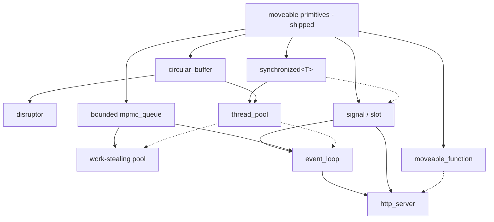

# Future directions

ts-moveables currently does one thing: it makes the immovable synchronisation primitives moveable under a single contract, so that concurrent classes get the rule of zero back. This document is the roadmap for what we build on top of that — and, just as importantly, what we deliberately do not build.

Everything here inherits the house rules:

- **The quiescent-move contract.** A move (or copy) either happens on a quiescent object or throws `std::runtime_error`. Moved-from objects stay valid.
- **Loud failure over undefined behaviour.** Where the standard library says UB, we throw.
- **No overhead where it matters.** Header-only, no dependencies, no allocation on hot paths, `static_assert`ed layout claims where we make them.
- **Simple and proven.** Plain `cassert` tests, ThreadSanitizer-clean across the CI matrix, and — for the performance-claiming components below — a benchmark harness, because a concurrency structure without numbers is a rumour.

Component dependency sketch:


```mermaid
graph TD
    P[moveable primitives - shipped] --> S[synchronized&lt;T&gt;]
    P --> R[circular_buffer]
    R --> D[disruptor]
    P --> G[signal / slot]
    S -.-> G
    S --> TP[thread_pool]
    R --> TP
    P --> Q[bounded mpmc_queue]
    Q --> WS[work-stealing pool]
    TP -.-> WS
    G --> EL[event_loop]
    Q --> EL
    TP -.-> EL
    EL --> H[http_server]
    G --> H
    P --> MF[moveable_function]
    MF -.-> H
```

---

## 1. `synchronized<T>` — the missing usage pattern ✅ shipped

**What.** A value of type `T` bonded to a `moveable_mutex`, where the *only* access path is through a closure that holds the lock:

```cpp
snicholls::synchronized<std::vector<int>> items;

items.with_lock([](auto& v) { v.push_back(42); });          // exclusive
auto n = items.with_lock([](const auto& v) { return v.size(); });
```

A `synchronized<T, moveable_shared_mutex>` variant gives `with_read_lock` / `with_write_lock`, and a condition-integrated `wait_until([](const T&){ ... })` builds on `moveable_condition_variable`. Copy copies the value under the lock; move follows the quiescent contract. Because the mutex inside is ours, `synchronized<T>` members compose and move like everything else in this library.

**Why it belongs here.** Today we give people moveable primitives; this gives them the safe *pattern*, and it structurally eliminates the classic misuse — locking, returning a reference, and touching it after unlock. There is no way to reach the `T` without holding the lock.

**Prior art, honestly.** `folly::Synchronized` is the best-in-class implementation but drags the whole folly dependency; `boost::synchronized_value` (Boost.Thread) is essentially unmaintained; `std::synchronized_value` is still a proposal (P0290). A header-only, dependency-free, *moveable* one has a real audience.

**Effort.** Small — roughly 150–200 lines plus tests. This ships first.

**Status: shipped** as `synchronized.hpp` — `synchronized<T, M>` (any BasicLockable `M`; shared-mutex `with_read_lock`; compile-time rejection of reference-returning closures; copy/move fully locked, so no quiescent contract is needed at all) plus `synchronized_waitable<T, M>` (`update` / `wait` / `wait_then` on `moveable_condition_variable_any`, with the waiter-checked move).

**Heterogeneous containers — resolved by composition, then shipped.** The question "should we build a thread-safe heterogeneous container?" has a pleasing answer: no *new* container is needed — `synchronized<T>` composed with the standard heterogeneous types covers it. That composition is now packaged in `synchronized_heterogeneous.hpp` as `synchronized_variant<Ts...>` (direct `visit`), `synchronized_tuple<Ts...>` (`get`/`set`/`apply`), `synchronized_any`, `synchronized_type_map` (one value per type — the blackboard/service-locator shape, with `with<U>(f)` as the race-free read-modify-write path), and `synchronized_bag` (open bag with typed `count`/`for_each`/`extract`). All single-lock. A finer-grained type map (per-type lock granularity) remains on the maybe-list only if a real workload shows the single lock is a bottleneck.

---

## 2. `circular_buffer` — a ring with clear, honest atomics ✅ shipped (benchmarks pending)

**What.** A fixed-capacity SPSC ring buffer whose entire concurrent state is two indices, and where you can point at them:

- `head` (consumer) and `tail` (producer), each a `moveable_atomic<size_t>`, each on its own cache line (`hardware_destructive_interference_size`) so producer and consumer never false-share.
- Acquire/release pairing only where the algorithm requires it, with a comment at each ordering decision saying *why* — the buffer should read as a teaching-quality reference, not a trick.
- Power-of-two capacity with monotonically increasing indices (wrap by mask, distinguish full/empty by difference — no wasted slot, no fragile full/empty flag).
- `try_push` / `try_pop` / `try_emplace`, batch variants (`push_n`, `pop_n`) because amortising the atomic traffic is where rings earn their keep, and a `capacity()`/`size()` snapshot.
- Both flavours: `circular_buffer<T, N>` (compile-time capacity, zero allocation, embeddable) and `circular_buffer<T>` (runtime capacity, one allocation at construction).

**Moveability — the differentiator.** Nobody ships a moveable one: `boost::lockfree::spsc_queue` and `moodycamel::ReaderWriterQueue` are both immovable, and `boost::circular_buffer` is not thread-safe at all. Ours moves under the quiescent contract: contents and indices transfer, the source is left empty and valid. One honest open question to resolve during design: a lock-free ring has no lock to probe, so the quiescence check cannot be exact the way the semaphore's is — options are a debug-build epoch/access counter (exact, small cost, compiled out in release) or a documented best-effort check. We will pick one deliberately and write down why.

**Copyability.** A copy is a snapshot and is only meaningful on a quiescent buffer; same mechanism as the move check. Trivially-copyable `T` gets a `memcpy` fast path.

**Scope discipline.** SPSC only. MPMC rings are a different algorithm with different costs — and that job belongs to the disruptor below. Saying no here keeps this component wait-free and comprehensible.

**Effort.** Medium. The code is short; the test and benchmark burden is the real work (TSan-clean under sustained two-thread hammering, throughput/latency numbers against Boost.Lockfree and moodycamel so the claim is grounded).

**Status: shipped** as `circular_buffer.hpp` — both flavours (`circular_buffer<T>` runtime capacity, `circular_buffer<T, N>` compile-time, one shared implementation), monotonic masked indices with producer/consumer index caching, every ordering choice commented, batch `push_n`/`pop_n`, `optional` pop, and full element-lifetime handling for non-trivial and move-only types. The open design question resolved: the quiescence probe is a per-side active flag — two relaxed stores to a cache line that side already owns (effectively free, always on) — best-effort by nature and documented as such. Tests cover wrap-around over thousands of cycles, construction/destruction balance, 100k-element SPSC runs (single and batched), and move/copy semantics.

A dependency-free benchmark harness now exists (`make bench`, `benchmarks/bench.cpp`) and grounds the *relative* claims on a single box. Preliminary numbers — 2014-era Intel Mac, Apple Clang, `-O3`, 2M items SPSC, best of 5, several sessions — for orientation only:

| Case | Throughput | Per op |
|---|---|---|
| `circular_buffer` singles (either flavour) | 45–260 Mops/s | 4–22 ns |
| `circular_buffer` batched (64) | 420–480 Mops/s | ~2.2 ns |
| `disruptor` publish/poll | ~28 Mops/s | ~36 ns |
| `std::mutex` + `std::queue` | ~9 Mops/s | ~112 ns |
| `moveable_spin_lock` + `std::queue` | ~13 Mops/s | ~75 ns |
| `synchronized_waitable<std::queue>` | 6–7 Mops/s | ~150 ns |

The single-op ring number swings several-fold run to run with thread placement — producer and consumer on sibling hyperthreads share L1/L2 and fly; on separate cores the line bounces. The batched number is stable precisely because batching amortises that coherency traffic — which is the design's whole argument, demonstrated by its own variance profile. Relative to a mutex queue on the same box: ~5× single-op on unlucky placement, ~50× batched. **The cross-library comparison (Boost.Lockfree, moodycamel) is still pending** and remains the bar before we make absolute performance claims; the harness is ready for it.

---

## 3. Disruptor — the ambitious one ✅ phases 1 and 2 shipped

**What.** A C++ implementation of the LMAX Disruptor pattern: a pre-allocated ring of events, sequence counters instead of queue locks, consumers that see *contiguous batches*, and explicit consumer dependency graphs (A and B both read an event before C may). The maintained-implementation gap in C++ is real — the existing ports are largely stale — and we have a concrete internal need for one, which is the right reason to build it.

**Shape.**

- The `circular_buffer`'s index discipline generalises into `sequence` (a padded `moveable_atomic<int64_t>`); the disruptor is sequences + claim strategy + wait strategy + the ring as storage. Build order above is deliberate: the ring is the disruptor's substrate.
- **Wait strategies map directly onto our primitives** — busy-spin (the `moveable_spin_lock` discipline), yielding, and blocking (`moveable_condition_variable`) — pluggable per consumer, because "burn a core for latency" and "sleep for throughput" are both legitimate.
- **Phase 1:** single producer, multiple consumers, dependency barriers, batch consumption. This is 80% of the pattern's value and avoids the hardest code.
- **Phase 2:** multi-producer claim (CAS on the claim sequence, per-slot availability marks). Only after phase 1 has numbers and miles on it.
- **Producer mode is a compile-time parameter, not a runtime flag.** Phase 1 is the path people benchmark; it must not acquire a branch, a CAS or an availability array to pay for a mode it never uses.
- Moveability of a whole disruptor follows the standard contract (quiescent: no producer mid-claim, no consumer mid-batch); realistically it moves during setup and teardown, which is exactly when people wire pipelines into objects.

**Bar to clear.** This component is only worth shipping with benchmarks against moodycamel and Boost.Lockfree, a written explanation of every memory-ordering choice, and stress tests that run long enough to mean something. If we cannot afford that bar, we should not ship it — a subtly wrong disruptor is worse than none.

**Effort.** Large. Phase 1 is a few weeks of careful work; phase 2 again as much. Cite: Thompson et al., *Disruptor: High performance alternative to bounded queues* (LMAX, 2011).

**Status: phase 1 shipped** as `disruptor.hpp` — single producer, any number of consumers, dependency graphs (`add_consumer({&a, &b})`), batch consumption with end-of-batch flags, batch publication (`publish_n`), pre-allocated events mutated in place, and the three wait strategies (busy-spin / yielding / blocking) mapped onto the primitives as planned. Wiring-after-start throws `std::logic_error`. One design choice worth noting: all shared state lives behind a stable heap core, so the disruptor *handle* moves freely even mid-flight — consumer references and running threads are unaffected — at the cost of one pointer indirection on the hot path. Tests cover gating (a producer genuinely blocked until the consumer frees room), a live-checked dependency barrier (C observes per event that A and B have passed it and that A's writes are visible), all three wait strategies, and a mid-flight handle move. Per-event memory-ordering rationale is written inline in the header.

**Status: phase 2 shipped** as `multi_producer_disruptor<T>` — an alias for `disruptor<T, WaitStrategy, producer_mode::multi>`. Producers CAS their sequences out of a shared claim counter (gating on the slowest consumer *before* the CAS, so a claim that would lap a slot still being read is never made), and publish by marking a per-slot availability entry. Consumers walk those marks to find the highest *contiguously* published sequence, which is what makes out-of-order publication safe: with several producers in flight, N+1 routinely lands before N, and the cursor alone can no longer mean "everything up to here is readable". Each mark holds the **round number** (`seq >> index_bits`), not a bool — a bool would have to be cleared when the slot is recycled and there is no safe moment to clear it (before the fill, a published event vanishes; after the fill, the previous lap's `true` reads as this lap's publication and a consumer walks into a half-written event). The round makes the mark self-describing, so wraparound can never be mistaken for availability and nothing needs clearing. That reasoning is written out in the header where the array is declared.

The decision that mattered most: **producer mode is a compile-time template parameter, not a runtime flag.** `multi_producer_state<false>` is an empty struct placed last in the core, and every mode-dependent site is an `if constexpr` — so the single-producer build allocates no availability array, carries no claim counter and executes no extra branch. Verified rather than asserted: the generated machine code for `publish` / `try_publish` / `publish_n` / `poll` / `last_published` in single-producer mode is byte-identical before and after phase 2 (578 instructions, zero differences, Apple Clang `-O3`).

The multi-producer mode is genuinely more expensive, and the numbers say so — same box and shape as the table above, 2M items through a 1024 ring, best of 5: single-producer ~25 Mops/s (39 ns/op), multi-producer with one producer ~10 Mops/s (95 ns/op), with two ~12 Mops/s, with four ~14 Mops/s. So the CAS claim plus the consumer's mark walk costs roughly 2.5× per op at one producer, and aggregate throughput then *climbs* with producer count as the walk amortises over larger batches. Reach for it when you actually have several producers; `disruptor<T>` remains the default for good reason.

Tests cover four and six producers publishing concurrently with exactly-once delivery checked by tally (no lost or duplicated events) through rings small enough to wrap thousands of times; a deterministic out-of-order case where one producer is held inside its fill while another publishes the next sequence, asserting the consumer sees neither until the hole is filled; a producer genuinely blocked by a lagging consumer; a torn-read check on every event across wraparound; a dependency graph under multiple producers (the barrier path, which does not consult the marks at all); a mid-flight handle move with the consumer thread running throughout; and all three wait strategies. Every test wait is bounded (`spin_until_for`) so a broken invariant fails the suite instead of hanging it.

---

## 4. Thread-safe signal/slot — events without the lifetime bugs ✅ shipped

**What.** `signal<void(Args...)>` with connect/disconnect/emit callable from any thread, RAII `connection` handles, and the three classic failure modes designed out:

- **Emission never holds the signal's lock while calling user code.** Emit grabs an immutable snapshot of the slot list (a `shared_ptr<const slot_vector>` swapped under a `moveable_mutex` on connect/disconnect; emission is one atomic snapshot grab plus direct calls). Slots may therefore freely connect, disconnect, or re-emit without deadlock. Hot-path emission allocates nothing.
- **Slot lifetime is explicit.** `connect(obj_weak_ptr, member)` auto-disconnects when the object dies; a disconnect that races an in-flight emission has defined semantics (the slot may see one final call — documented, like Boost.Signals2's guarantee, but without its per-emission locking cost).
- **Moveability with a twist that fits this library.** Connections bind to the signal's shared internal state, not to the signal object's address — so a `signal` member moves freely with its owner and every existing connection stays valid. The quiescent contract covers the rest. This is something none of the incumbents offer cleanly, and it is *the* reason a signal belongs in a moveables library: signals are exactly the members that pin otherwise-moveable objects in place.

**Prior art, honestly.** Boost.Signals2 is thread-safe but heavyweight and slow on emission (mutex work per emit); libsigc++ is not meaningfully thread-safe; `palacaze/sigslot` is the strongest modern header-only option and deserves study before we write a line — our justification is moveability, integration with these primitives, and a smaller surface, not novelty for its own sake. If study shows sigslot already does everything we want, the right outcome is a recommendation in the README, not a component.

**Effort.** Medium. The snapshot-swap core is small; the lifetime-tracking edge cases are where the tests earn their keep.

**Status: shipped** as `moveable_signal.hpp` (named to dodge POSIX `::signal`, which makes the unqualified short name ambiguous once `<csignal>` leaks in — discovered the hard way on macOS). The prior-art study happened as promised: *nano-signal-slot* does not guarantee emission order and its default thread-safe policy holds locks during emission ("does not mitigate any deadlocks that could occur due to slot emissions fiddling with their signals"); *palacaze/sigslot* is solid on thread safety and weak-ptr tracking but silent on moveability — neither moves a signal with live connections. So the component was justified, and the shipped design delivers the plan: snapshot emission (no lock held while calling user code, no emit-path allocation), guaranteed connection order, `connection`/`scoped_connection` handles valid even after the signal dies, weak-ptr auto-disconnect with the target held alive during dispatched calls, and free moveability via shared internal state. Reentrancy (connect/disconnect/re-emit from inside slots) and cross-thread emission are covered by tests.

---

## 5. Thread pool — an interface for comparing implementations

**What.** A tiny pure-virtual `task_pool` interface, and several concrete implementations that span the design space, so they can be raced against one identical workload. The interface is the deliverable as much as any single pool: good thread pools are rare, and the reason is that the interesting choices (one shared queue vs. sharded vs. lock-free hand-off; block vs. spin; steal vs. partition) are hard to compare fairly without a common harness. This library already measures everything and compares honestly — the pool is that ethos pointed at itself.

```cpp
struct task_pool {
    using task = std::function<void()>;
    virtual ~task_pool() = default;
    virtual void submit(task) = 0;              // enqueue work
    virtual void wait_idle() = 0;               // block until all submitted work has run
    virtual std::size_t worker_count() const noexcept = 0;
};

// result-returning submission over ANY implementation - non-virtual, generic,
// like snicholls::call_once: wraps a packaged_task, returns its future
template <class F>
std::future<std::invoke_result_t<F>> async(task_pool&, F&&);
```

**The implementations — three points on the spectrum, built from our own parts.**

- `mutex_task_pool` — one `synchronized_waitable<std::deque<task>>`; workers block on its condition variable via `wait_then`; submit from any thread. The honest "correct but contended" reference every faster design must beat.
- `sharded_task_pool` — *K* independent shards, each a `synchronized_waitable` queue, round-robin on an atomic index; submit from any thread. Trades one hot lock for *K* cool ones — the cheapest real win, and it shows the library's "shared-nothing scales" thesis with a knob.
- `dispatch_task_pool` — the `circular_buffer` showcase: one lock-free SPSC ring per worker, hand-off with no lock at all. **This is where the ring genuinely fits, and its constraint is the point:** the ring is SPSC, so this pool documents a *single-dispatcher* contract — `submit` is called from one thread. That is not a cop-out; it is the deterministic feed-handler pattern from low-latency systems (one thread fans a market-data feed out to a worker per partition), and naming the constraint is more honest than a "general" pool that quietly serialises submission behind a lock.

**Why the interface earns its keep despite the cost.** The virtual `submit(std::function<void()>)` path pays a type-erasure and a virtual call per task — exactly the overhead the rest of the library avoids. The framing is the same as `moveable_mutex<M>` versus the raw primitives: the interface is for *comparison and polymorphic wiring*; a latency-critical caller takes a concrete pool by value and submits a concrete callable. The bench races all three (plus `std::async` as an external yardstick) on the same task graph, so the per-implementation cost is visible rather than asserted.

**Completion and shutdown.** `wait_idle` rides a shared completion tracker — an atomic outstanding-count plus a `moveable_condition_variable`, decremented as each task finishes. Destruction signals stop, drains whatever is already queued, and joins — so a `wait_idle` can never be left hanging by a shutdown. Pool state lives behind a heap core (disruptor-style), so the concrete handle is *moveable* — and polymorphic users already hold it through a moveable `std::unique_ptr<task_pool>` regardless.

**Prior art, honestly.** There are hundreds of C++ thread pools and few good ones; the good ones (Taskflow's executor, TBB, Tokio's multi-thread scheduler, `progschj/ThreadPool` as the popular-but-basic baseline) are work-stealing and hard to beat. **We do not claim to beat them, and must not.** What we add is narrow and real: pools built visibly from this library's own primitives (so the toolkit is shown composing), a moveable pool handle, dependency-free/header-only/C++17, and — the actual product — a level comparison harness. This also completes the story the taskflow demo started: *static* dependency graphs need no pool (shown, scheduler-free); *dynamic* task submission is exactly where a pool earns its place.

**Effort.** Medium. The interface and completion tracker are small; each pool is a worker loop differing only in its queue; the honest work is the bench and the TSan runs under churn.

---

## 6. Bounded MPMC queue and a work-stealing pool — the "real" general pool ✅ shipped

**What.** The high-performance, submit-from-anywhere pool that section 5 deliberately does *not* attempt, plus the component it must be built on first.

The blocker is structural and worth stating precisely: our `circular_buffer` is SPSC, and a general pool's core need is one of two queues neither of which is SPSC — a **bounded MPMC queue** (many submitters, many workers, one shared queue) or a **Chase-Lev SPMC deque** per worker (owner pushes/pops one end, thieves take the other) for work stealing. So this line depends on a new primitive:

- **`mpmc_queue<T>`** — a bounded, lock-free multi-producer/multi-consumer ring in the Vyukov style (per-slot sequence numbers, CAS on the enqueue/dequeue tickets). Moveable under the quiescent contract, cache-line-padded ends, the same teaching-quality commenting as the SPSC ring. Valuable in its own right, independent of the pool.
- **work-stealing pool** — per-worker deques, victims chosen at random on starvation, built on a Chase-Lev deque. This is the design that actually competes with the incumbents on load balance.

**Why gated, not now.** Both are genuinely hard to get right (the Vyukov queue's memory ordering; Chase-Lev's ABA and resize hazards), and both must clear the same bar as the disruptor — benchmarks against moodycamel and TBB, every ordering choice justified inline, long stress runs — or they should not ship. Section 5 gives users a working, honest pool immediately; this section is the upgrade path, and the MPMC queue is the prerequisite gate. It also brushes against the "no lock-free container zoo" non-goal, so it ships only if it clears the "what do we add that moodycamel doesn't" test — and the answer had better be *moveability plus the queue as a reusable building block*, not "another MPMC queue."

**Effort.** Large, twice over. Do not start until section 5 has miles on it and there is a concrete need the sharded/dispatch pools cannot meet.

**Status: shipped.** `mpmc_queue.hpp` is the bounded Vyukov MPMC ring — per-cell sequence numbers, CAS tickets, placement-new cells with full element-lifetime handling (non-trivial and move-only `T`), moveable when quiescent (unchecked, and documented as such: no cheap per-side probe exists on the lock-free path, and a shared in-flight counter would contend the very hot path the design keeps clean). `work_stealing_deque.hpp` is the bounded Chase-Lev deque with the CDSChecker-verified orderings from Le et al. (2013), storing pointers so the single-element steal race never touches the pointee. Two new pools use them: `mpmc_task_pool` (one shared `mpmc_queue`, general submit-from-anywhere — the pool the single-dispatcher one could not be) and `work_stealing_task_pool` (per-worker Chase-Lev deques + an `mpmc_queue` injector + random-victim stealing + thread-local routing so a task that spawns work pushes to its own hot deque). One design lesson banked during the build: a bounded injector plus blocking backpressure *deadlocks* a fork-join (every worker can be stuck submitting while none drains), so the work-stealing pool runs a task inline on saturation — deadlock-free backpressure. The MPMC queue is verified with a 4-producer/4-consumer exactly-once test; the pool with a fork-join that forces the local-deque, injector, steal, and inline paths all at once; both survive heavy watchdog stress. Benchmarks: `mpmc_task_pool` ~3.6 M external submits/s, `work_stealing_task_pool` ~7.5 M tasks/s on fork-join (4× its external-submit rate — the locality win, measured). Still honestly short of Taskflow/TBB on a real workload; the value delivered is the two reusable lock-free components and pools that compose the toolkit, not a new speed record.

**Head-to-head, done.** `make bench-compare` now runs the same harness against moodycamel's `ReaderWriterQueue` (SPSC) and `ConcurrentQueue` (MPMC) — the field's reference implementations, fetched on demand and never committed (the library stays dependency-free). The honest result: **moodycamel wins — consistently on SPSC, cleanly on MPMC (~6.5 vs ~3.5 Mops/s, stable)** on the Intel box. The SPSC result took several runs to read honestly, and the reading is the interesting part: single-op SPSC throughput is *placement-dominated*. Our slot ring touches a shared atomic every op, so it swings ~10× with thread placement (~40 Mops/s on separate cores, ~300–480 when the two threads share cache); moodycamel's block-based queue touches its shared atomics ~1/512 as often, so it holds ~215–460 Mops/s regardless. moodycamel is faster *and* far more placement-robust; our ring only reaches its league on a lucky placement. That variance is the design difference (per-op atomic vs block amortisation) made visible — and our batched paths (`push_n`, `publish_n`) close it stably because they amortise the same way. Do not trust any single row from this benchmark; understanding the spread is the point. This retires the "performance claims unproven" gap honestly: we do not beat the specialist queues on raw single-op throughput, and the docs now say so with the variance properly explained rather than a cherry-picked number. The comparison also motivated a simplification. An earlier round added a `Checked` template switch to trade the move-check for speed; measuring it carefully showed the move-check was never the real cost (the swings I first read as the switch's effect were thread placement). So the switch was **removed** in favour of a store-free move-check: the ring detects concurrent use by *sampling head_/tail_ at move time* rather than flagging every op, which costs the hot path nothing and needs no knob. One ring type, always safe, and ~27 % faster than the old flag-based ring as a bonus. The specialist-queue gap is unchanged and architectural — block-based amortisation vs our per-op slot atomics — and anyone who needs ~450 Mops/s single-op SPSC should reach for moodycamel, exactly as the non-goals say. Simpler *and* faster: the right kind of change.

---

## 7. `event_loop` — a clean, typed, honest reactor

**What.** A small readiness-based (reactor) event loop whose dispatch layer is `moveable_signal`, whose handles are moveable RAII objects, and whose internals are this library's own components. Most event loops are pattern soup — reactor and proactor mixed ad hoc, raw callbacks with manual lifetimes, portability bolted on per OS. There is a real gap for a *small, typed, portable-core* loop with lifetimes that are safe by construction.

```cpp
snicholls::event_loop loop;
auto w = loop.watch(fd, fd_interest::read);
auto c = w.on_readable().connect([&] { /* typed, ordered, lifetime-safe */ });
auto t = loop.every(10ms);                    // t.on_fire() is a signal too
loop.post([] { /* from any thread */ });      // mpmc_queue + self-pipe wakeup
loop.run();
```

**The edge — why this library specifically:**

- **Dispatch is `moveable_signal`.** fd readable / timer fired / task posted all flow through typed signal emission: weak-ptr lifetime tracking (no use-after-free when a handler's object dies), guaranteed connection order, reentrancy already proven (handlers may add/remove watches mid-dispatch — snapshot semantics), RAII teardown. This kills the #1 event-loop bug class *structurally*.
- **Moveable handles — our signature, applied where nobody has it.** libuv handles are pinned; Asio objects are entangled with their `io_context`. An `fd_watch` or `timer` that is a moveable member of a session object — rule of zero, lives in a `std::vector` — is exactly this library's story.
- **A replayable loop.** Because everything dispatches through signals, a journal tap (`on_dispatch`) can record the lot, and replay is re-emission into the same handler graph — the capture/replay discipline already proven bit-exact in the demos. A deterministic, replayable event loop is something essentially no mainstream loop offers.
- **The economics finally favour elegance.** `epoll_wait`/`read` syscalls cost ~1 µs+; typed-signal dispatch costs tens of ns — measurably negligible here, unlike the queue head-to-head. The clean abstraction is free at this altitude, and the bench will show it.

**Prior art, honestly.** Asio is the powerful everything-machine (and famously baroque: io_context, strands, work guards, executors); libuv/libevent/libev are C with baton-passing lifetimes; Qt's loop is welded to QObject; glib is C; C++26 got `std::execution` but standard IO integration did not land. None offers typed lifetime-safe dispatch or moveable handles. We complement Asio, not replace it — and say so.

**The hard part, refused up front: Windows.** IOCP is a *proactor* — completion-based, structurally different — and bridging the two models is precisely why Asio is complicated. We do not sign up for that swamp: phase 1 is POSIX (epoll / kqueue / `poll()` fallback); the header self-disables on Windows; phase 2 may add a sockets-only `WSAPoll` backend. For IOCP-grade Windows IO, use Asio — stated plainly, same honesty as the moodycamel section.

**Shape.**

- **Phase 1 — POSIX reactor:** a tiny `poller` backend (epoll on Linux, kqueue on macOS/BSD, `poll()` fallback, forceable via macro); `event_loop` with a heap-stable core (the handle moves freely, disruptor-style); `fd_watch` with `on_readable`/`on_writable`/`on_error` signals; one-shot and periodic timers (min-heap, loop-thread-owned, no locks); `post()` from any thread (`mpmc_queue` + non-blocking self-pipe wakeup); `run` / `run_once` / `stop`; the `on_dispatch` journal tap. **Threading contract, named honestly:** one thread runs the loop; watches and timers are created on the loop thread (or before `run`); violations throw `std::logic_error`; cross-thread `post` is the one door in; cross-thread watch destruction marshals itself through `post`. Level-triggered semantics throughout.
- **Phase 2 — comfort:** POSIX signals (signalfd / kqueue `EVFILT_SIGNAL`) as signal emissions; Windows sockets-only `WSAPoll` backend; a backpressure-aware write helper.
- **Non-goals:** no proactor/IOCP, no SSL or protocol stacks, no filesystem watching, no general async model — Asio exists.

**Bar to clear.** TSan-green across the matrix; a self-verifying **replayable-loop demo** (journal a scripted session over socketpairs, replay into a fresh handler graph, assert identical output hashes); a bench row measuring dispatch overhead against a raw epoll/kqueue loop, publishing the "syscall dominates, elegance is free" number honestly.

**Effort.** Large-ish but bounded: the poller backends are ~50 lines each; the loop core is the careful part; the tests and the replay demo are where the honesty lives.

---

## 8. HTTP/HTTPS server — delegates all the way down

**What.** A drop-in, header-only HTTP/HTTPS server in the [cpp-httplib](https://github.com/yhirose/cpp-httplib) mould — same one-include ergonomics, same `get`/`post` routing feel — but built as a *reactor* on `event_loop`, with every policy decision (TLS backend, compression, logging, routing) expressed as a **delegate object** rather than a compile-time `#ifdef` or a hard-wired member.

**Why cpp-httplib leaves the door open — said with respect.** httplib earned its popularity: one header, zero setup, it just works. But its own README is candid about the ceiling: it uses *blocking* socket IO on a thread pool (default ~8 to 4× cores) — "if you are looking for a server which handles requests in a non-blocking manner, this is not the one that you want" — and large simultaneous connection counts are outside its design target. Its TLS story is real (OpenSSL 3.0+, mbedTLS, wolfSSL, best-effort BoringSSL) but chosen by preprocessor forest (`CPPHTTPLIB_OPENSSL_SUPPORT`, …): one backend per binary, decided at compile time, tested combinatorially or not at all. And the single ~10k-line header has grown ad hoc, which is where its long bug tail — overwhelmingly in protocol parsing — comes from. None of this is a criticism of intent; it is a list of things a second-generation design gets to fix.

**The design insight — moveable delegates.** This is the whole library folded back on itself. A server is a bundle of strategies (TLS engine, compressor, router, logger) plus thousands of per-connection sessions (socket, parser state, buffers, watch, timers). Classically none of that moves: sessions pin themselves the moment they contain a mutex, an Asio object, or a self-referential callback, so servers end up as graphs of `shared_ptr` spaghetti. Here, **delegates and sessions are moveable objects**: a `session` holding its `fd_watch`, its timers, its TLS delegate and its half-parsed request is a plain moveable value — it lives in a flat container, migrates between event loops (the multi-reactor `SO_REUSEPORT` sharding pattern falls out for free), and obeys the rule of zero. That is the capability that did not exist before this library, and the server is its showcase.

### Two axes, not one — the shape the whole design hangs on

Every HTTP server conflates two independent questions. Separating them is what makes one delegate architecture cover HTTP/1.1 through HTTP/3 without a rewrite:

- **Transport delegate** — *how bytes reach us.* `tcp_plain`, `tcp_tls` (OpenSSL / BoringSSL / wolfSSL / mbedTLS), `quic` (UDP with TLS 1.3 welded in). It owns encryption and, for QUIC, ordering and loss recovery.
- **Protocol delegate** — *how bytes become requests.* `http1` (text, one message at a time), `http2` (binary framing + HPACK, multiplexed), `http3` (binary framing + QPACK, multiplexed over QUIC streams).

They compose as a matrix, and every cell is chosen **at run time**:

| Transport | Protocol | Selected by |
|---|---|---|
| TCP, plaintext | HTTP/1.1 | default |
| TCP, plaintext | HTTP/2 (h2c) | prior knowledge / `Upgrade` |
| TCP + TLS | HTTP/1.1 | ALPN `http/1.1` |
| TCP + TLS | HTTP/2 | ALPN `h2` |
| QUIC (UDP) | HTTP/3 | ALPN `h3`, advertised via `Alt-Svc` |

ALPN is the selector: the TLS delegate reports the negotiated protocol and the server constructs the matching protocol delegate for that connection. **This is the thing a `#ifdef` architecture structurally cannot do** — if your TLS backend is a compile-time constant, so is your protocol matrix, and you cannot serve h2 and http/1.1 from one binary chosen per connection without hand-wiring it. Runtime delegates make it a two-line factory.

**The stream-shape decision, made now, on purpose.** HTTP/1.1 and HTTP/2 both ride a single ordered byte stream. HTTP/3 does not — QUIC hands you *many* independent streams and does per-stream ordering itself. So the protocol/host interfaces carry a `stream_id` from day one; it is always `0` for HTTP/1.x, real for h2, and a QUIC stream number for h3. That is an integer parameter, not speculative machinery, and it is the difference between HTTP/3 slotting in and HTTP/3 forcing a rewrite. We are explicit that this is the *one* piece of forward design we pay for up front.

**Async responders — the moveability payoff, and the reason we scale.** A handler receives `(const request&, responder)` where `responder` is a **moveable, complete-once** handle. Answer inline, or move it into a queue, a thread pool, or another event loop and answer later from any thread (completion marshals back through `post()`). This is precisely what a blocking server cannot do — httplib holds a whole thread per in-flight request, which is *why* its ceiling is its pool size — and it is only safe here because the handle moves safely. Dropping a responder without answering sends 500 rather than hanging the client: loud failure over undefined behaviour, the house rule, applied to HTTP. It is also what makes HTTP/2 tractable: multiplexed streams complete out of order by nature.

### Delegate architecture

- **TLS delegates** — one pure-virtual interface, chosen at runtime: `openssl_tls`, `boringssl_tls`, `wolfssl_tls`, `mbedtls_tls`. The engine is **transport-agnostic** (memory-BIO style: ciphertext in, plaintext out, and the reverse) so TLS never touches a socket — the reactor owns all IO, the delegate is a pure byte transformer. Every backend becomes testable without a network, the WANT_READ/WANT_WRITE dance is explicit, and the plaintext path is the TLS path with an identity delegate. TLS backends live in *separate opt-in headers* so the core stays dependency-free.
- **Compression delegates** — `identity`, `gzip`, `brotli`, `zstd`: registered per content-coding and negotiated per request from `Accept-Encoding`; same byte-transformer shape as TLS, so they compose.
- **Routing** — `server.get("/users/:id", handler)`, `server.post(...)`; segment patterns with `:param` captures and a trailing `*`.
- **Signals for everything cross-cutting** — `on_open`, `on_access`, `on_close`, `on_error` are `moveable_signal` taps: logging, metrics and tracing attach without touching the hot path, and because the loop already has its dispatch tap, **HTTP session capture and replay comes for free** — the same discipline the demos already prove bit-exact.
- **Leverage [base-encode-decode](https://github.com/saxonnicholls/base-encode-decode)** — as an *optional adapter*, not a core dependency. The WebSocket accept key needs base64 of one 20-byte digest, which is ~35 lines and is kept local so the drop-in single header stays genuinely dependency-free. Where the library earns its place is **HTTP Basic auth**: real base64 of arbitrary credentials, with the padding and validation edge cases an encoding library should own. Add it then, in the same tier as `tls_openssl.hpp`.

**Packaging: genuinely one file.** `http_server.hpp` is a single header that includes `event_loop.hpp` and `moveable_signal.hpp` from the same directory. For true httplib-style drop-in, `scripts/amalgamate.sh` emits `single_include/ts_http_server.hpp` — one self-contained file, no include path, no build system, nothing to link but pthreads.

### WebSocket — the delegate architecture's cleanest win

WebSocket (RFC 6455) is where the two-axis split stops being theory and starts paying rent. A WebSocket connection *is* an HTTP connection that changed protocol mid-flight — which in this design is one line: after the `Upgrade` handshake, **swap the protocol delegate on a live connection**, `http1_protocol` → `websocket_protocol`, leaving the transport, the session, the buffers and the fd watch exactly where they are. `wss://` needs no work at all: it is `ws` over the TLS transport delegate, and the two axes never knew about each other. Frameworks that hard-wire HTTP into the connection object have to grow a parallel WebSocket stack; here it is a delegate, and the server is already a reactor, which is what a protocol of long-lived idle connections actually wants. Ten thousand mostly-idle sockets is the *bad* case for a thread-per-connection server and the *normal* case for us.

What it takes, concretely:

- **Handshake** — validate `Upgrade: websocket`, `Connection: Upgrade`, `Sec-WebSocket-Version: 13` and `Sec-WebSocket-Key`, then answer 101 with `Sec-WebSocket-Accept` = base64(SHA-1(key + the RFC's magic GUID)). Base64 comes from [base-encode-decode](https://github.com/saxonnicholls/base-encode-decode); SHA-1 here is a fixed ritual rather than a security primitive, so a small local implementation keeps the plaintext build dependency-free (and the TLS delegate can supply one when present).
- **Framing** — FIN/RSV/opcode, the mask bit, 7 / 7+16 / 7+64 payload lengths, the 4-byte masking key, continuation frames for fragmented messages, and control frames (close, ping, pong) that are never fragmented and never exceed 125 bytes. Client-to-server frames **must** be masked and unmasked ones are a protocol error; server-to-client frames must not be.
- **Correctness details that bite** — UTF-8 validation on text frames (strictly, including split-across-frames sequences), the two-way close handshake with status codes, ping/pong keepalive on the loop's own timers, and hard caps on frame and message size. `permessage-deflate` (RFC 7692) is not new work: it is the **compression delegate** again, with context-takeover rules.
- **The grader** — the [Autobahn|Testsuite](https://github.com/crossbario/autobahn-testsuite) is the external, unarguable bar, exactly like h2spec and the QUIC interop runner. Green Autobahn or it does not ship.
- **Later versions** — WebSocket over HTTP/2 is extended CONNECT (RFC 8441) and over HTTP/3 is RFC 9220. Both are *transport-and-protocol* plumbing rather than a new WebSocket, which is the point of keeping the axes apart.

The API should stay in the house style — signals, moveable handles:

```cpp
srv.websocket("/ws", [](websocket ws) {              // ws is a moveable handle
    ws.on_message().connect([&ws](const ws_message& m) { ws.send_text(m.text()); });
    ws.on_close().connect([] { /* ... */ });
});
```

### HTTP/2 — tractable, and worth doing natively

Framing (RFC 9113) is a bounded problem: a 9-byte frame header, a dozen frame types, per-stream and connection flow-control windows, and a stream state machine. **HPACK** (RFC 7541) is the real work — a 61-entry static table, a dynamic table with eviction, and canonical Huffman coding — mechanical but unforgiving, and the source of most h2 CVEs elsewhere (including HPACK-bomb style decompression amplification, which needs an explicit decoded-size cap).

The choice is implement natively or wrap nghttp2 as a protocol delegate. **Recommendation: native**, because it keeps the zero-dependency promise for cleartext h2c, it is bounded work, and there is an external grader — [h2spec](https://github.com/summerwind/h2spec) — so the claim can be *measured* rather than asserted. Wrapping nghttp2 stays available as a second delegate if native h2 proves more expensive than it looks; the interface makes that a swap, not a rewrite. Also required: `Alt-Svc` advertisement so browsers can upgrade to h3, and rejection of the h2 header-flood / RST-flood patterns (the 2023 "Rapid Reset" class) with per-connection limits.

### QUIC and HTTP/3 — we wrap, we do not write

Said plainly, because the alternative is the single biggest way this project could destroy itself: **implementing QUIC is not on the table.** QUIC (RFC 9000/9001/9002) is loss detection and congestion control, three packet-number spaces, stream *and* connection flow control, connection migration across paths, 0-RTT with replay defence, anti-amplification limits, path validation, retry tokens, key updates, and version negotiation — a multi-year, security-critical codebase. Every credible QUIC is a dedicated project with a team: [ngtcp2](https://github.com/ngtcp2/ngtcp2), [quiche](https://github.com/cloudflare/quiche) (Cloudflare), [msquic](https://github.com/microsoft/msquic) (Microsoft), [lsquic](https://github.com/litespeedtech/lsquic), [picoquic](https://github.com/private-octopus/picoquic), [s2n-quic](https://github.com/aws/s2n-quic) (AWS). Our value-add is not another QUIC stack; it is the clean reactor and delegate architecture *around* one.

So `quic_transport` wraps a QUIC library exactly as `tls_delegate` wraps OpenSSL — same pattern, same honesty, same opt-in header. The reactor's job is the part we are actually good at: own the UDP socket, watch it readable, feed datagrams in, pull datagrams out, and drive the library's timers off `event_loop` timers instead of the ad-hoc timer wheel these integrations usually grow.

Three consequences worth writing down before anyone is surprised by them:

- **UDP changes the loop's shape.** One UDP socket serves *all* connections, demultiplexed by QUIC connection ID rather than by fd — so the "one fd per connection" assumption baked into the phase-1 session map does not hold for h3. The session lookup must be keyed by an opaque connection key, with fd as the phase-1 instantiation. Cheap now, expensive later. Also: `recvmmsg`/`sendmmsg` batching and GSO/GRO are where real h3 throughput comes from, and both want the reactor to hand the library *many* datagrams per wake — worth designing for, not retrofitting.
- **QUIC constrains the TLS backend.** QUIC needs a TLS API that exports handshake secrets rather than encrypting a byte stream. BoringSSL has had that API for years (which is why quiche and ngtcp2 target it); OpenSSL added client-side QUIC in 3.2 and server-side QUIC in 3.5 (the LTS line); wolfSSL supports the ngtcp2 integration; mbedTLS has no QUIC handshake API. So the h3 cell of the matrix is not available on every TLS delegate, and the factory must say so out loud rather than fail mysteriously.
- **HTTP/3 itself is the tractable part.** Once QUIC streams exist, h3 is framing (RFC 9114) plus **QPACK** (RFC 9204) — HPACK's cousin, redesigned so header compression survives out-of-order stream delivery, with its own encoder/decoder streams and a blocked-streams limit. Native is plausible; [nghttp3](https://github.com/ngtcp2/nghttp3) is the ready-made alternative and pairs with ngtcp2. Decide with measurements, not taste. The external grader here is the [QUIC interop runner](https://interop.seemann.io/).

### The hard parts, named up front

- **HTTP/1.1 parsing correctness.** This is where httplib's bug history lives and where ours would too. The parser must be incremental and resumable (a request arrives in arbitrary fragments), and *strict*: reject `Content-Length` together with `Transfer-Encoding`, conflicting duplicate `Content-Length`, whitespace before the colon, obsolete line folding, and bare LF line endings — every one of those is a documented request-smuggling vector, and leniency is how servers become gadgets in someone else's attack chain. Torture corpus from day one, not later.
- **TLS handshakes in a non-blocking world.** The memory-BIO engine makes the state machine explicit, but renegotiation, close-notify and half-closed connections still have to be walked carefully.
- **Abuse and backpressure.** Bounded write buffers with read-pause at high water, slowloris timeouts on the loop's own timers, header/body size caps, connection caps — and the classic reactor trap: **`EMFILE`**. When the process runs out of file descriptors, `accept()` fails forever on a level-triggered loop and the server spins at 100% CPU serving nobody. The fix (hold a reserved fd, close it, accept-and-close the excess connection, reopen the reserve) is fifteen lines and belongs in phase 1, not in a post-mortem.
- **Scope discipline.** No client (initially), and no static-file server until the path-traversal story is written down. Each is a separate decision later, not scope creep now.

**What Autobahn found.** Exactly the class of defect a self-written suite cannot: we echoed *invalid* close codes (0, 999, 1004, 1005, 1006, 1016, 1100, 2000, 2999) straight back instead of rejecting them with 1002, because our tests and our implementation shared the same assumption. Nine cases, one fix, and a standing argument for grading against an external suite rather than one's own opinion. It also surfaced a reference cycle — a parked connection whose slot captured a handle that owned the state that owned the connection — which leaked per-socket state on every close.

### Compile-time regular expressions — assessed, and declined for the core

[CTRE](https://github.com/hanickadot/compile-time-regular-expressions) (Hana Dusikova) is excellent work: it compiles a pattern into a matcher at compile time and comfortably beats `std::regex`, which is one of the slowest facilities in the standard library. The instinct to reach for it in a router is sound, and it is worth being precise about where it does and does not pay here.

**Not on our hot path, because our router does not use regex at all.** Route matching splits the path on `/` and compares segments, capturing `:name` and a trailing `*`. That is linear in the number of segments with no backtracking, no pattern state machine, and no allocation. A compiled regex would be slower for that shape, not faster - the win CTRE offers is against `std::regex`, and we are not paying `std::regex`. Worth noting that cpp-httplib *does* route through `std::regex`, which is likely part of why its per-request cost is what it is; declining regex entirely is the cheaper answer to the same problem.

**Where it would genuinely earn its place** is as an *opt-in* adapter for people who want real pattern routes - `ctre_route<"/users/([0-9]+)/posts/([0-9]+)">(handler)` - giving regex expressiveness at close to hand-rolled cost. That belongs in the same tier as `tls_openssl.hpp`: a separate header, clearly outside the dependency-free core, added when someone actually wants it. Header-only and compile-time makes it a good citizen, but it is still a dependency, and the core's promise is that there are none.

**Verdict:** no for the core and no for routing as it stands; yes as an optional `ctre_routes.hpp` if regex routes are ever asked for, where it would be strictly better than the `std::regex` approach it replaces. Filed here rather than built, per the usual rule.

### `moveable_function` — the honest verdict

`std::function` is already moveable, so a bare rename adds nothing. The gap is *lifetime*: a route handler bound to a service object must stop firing when that object dies — today that is a dangling `this` and a core dump. A `moveable_function<R(Args...)>` worth building is the single-slot, return-valued sibling of `moveable_signal`: same weak-`shared_ptr` target tracking (an expired target makes the call a no-op or a loud error, caller's choice), same quiescent-move contract, small-buffer storage so the common case does not allocate. Small, real, and exactly what the router should store. Phase 1 uses `std::function` and says so; `moveable_function.hpp` lands when the tracking is wanted, not before.

### Phases, and the bar each must clear

| Phase | Scope | Bar |
|---|---|---|
| **1** | Plaintext HTTP/1.1 reactor: strict incremental parser, router, keep-alive, chunked, async responders, backpressure, `EMFILE` guard, signal taps | parser torture suite green, TSan green, end-to-end tests over real sockets |
| **2** | ✅ **OpenSSL shipped** (`tls_openssl.hpp`, opt-in): memory-BIO engine, ALPN reported, HTTPS + `wss` green. Still owed: a second backend to prove the interface, and streaming responses. Ships with **streaming responses** (`res.stream()`), since both touch the write path and a TLS file server that buffers whole files in memory is not a file server | HTTPS end-to-end, ALPN reported, two backends passing the same tests |
| **3** | ✅ **WebSocket shipped** (`websocket.hpp` + `websocket_deflate.hpp`): handshake, framing, masking, fragmentation, close/ping/pong, UTF-8 validation as a protocol-delegate swap, and `permessage-deflate` as an extension delegate | ✅ **Autobahn clean: 517 of 517 cases, 0 failures, 0 unimplemented** (510 OK, 4 non-strict, 3 informational). `make autobahn` |
| **4** | HTTP/2: framing, HPACK, h2c and h2-over-ALPN, flow control, flood limits | [h2spec](https://github.com/summerwind/h2spec) green |
| **5** | QUIC transport delegate (wrapping ngtcp2 or quiche) + HTTP/3 with QPACK, `Alt-Svc`, datagram batching | [QUIC interop runner](https://interop.seemann.io/) handshake/transfer/retry cases |
| **6a** | The head-to-head: **10,000+ concurrent connections** vs cpp-httplib, plus a low-concurrency run where their blocking pool is at its best, plus an idle-WebSocket fan-out where the reactor should win biggest | ✅ **first pass done** (`make bench-http`) — ~10× throughput, and 10,000 held connections served in 168 ms against 124 of 10,000 in 20 s. Still owed: a real network rather than loopback, and a second machine |

**Phase 6b — nginx, and why it is the opponent that matters.** cpp-httplib is a *different* architecture, so beating it grades the design. nginx is the *same* architecture executed extremely well — a mature multi-process reactor with two decades of tuning, `sendfile`, and a hand-written parser — so it is the opponent that grades our code. Going in, the honest expectation is that we lose on raw throughput; publishing that is worth as much as publishing the httplib result, and the gap size is the useful number. It needs a different harness: nginx is an external process, so the load generator must drive a configured server it did not start, with a matched route and response size. Worth adding at the same time: a second machine, because every number so far has the load generator competing with the server for the same cores, and both the concurrency plateau and the scaling plateau are artefacts of that.

**What phase 6a actually found — the reason benchmarks earn their keep.** Two defects in our own code, neither visible by reading it:

- *Write coalescing.* Responses were flushed individually, so 32 pipelined requests cost 32 `send()` calls. The signature was a hard throughput ceiling with the machine 90% idle. Fixing it (coalesce inside the read loop; still flush immediately for off-thread completions, which have no read loop returning for them) was worth 2.7× on pipelined traffic.
- *`constexpr` character tables.* Replacing the token/hex predicates with compile-time 256-entry tables is worth ~3% on a one-header request and ~8% on a twelve-header one, and cuts run-to-run variance from 14% to 2%.

And one defect in the *harness*, which is the more instructive one: a `select()`-based connect made every server appear to plateau at ~509 connections, including ours, because `FD_SETSIZE` is 1024 and client plus server descriptors cross it there. A benchmark that flatters or flattens everything equally looks exactly like a real result. The per-reactor and CPU-usage diagnostics exist because of that.

The structural expectation for the head-to-head was that a reactor holds the C10K line and a thread-per-request pool cannot. That has now been measured (see the README table), and it held: the concurrency gap is categorical, not incremental, and tuning httplib's pool up to 1024 threads made it *worse* rather than better. Two honest qualifications stand: our server does less per request than theirs, so part of the throughput multiple is feature cost rather than architecture; and loopback on one box is not a network. The remaining phase-6 work is therefore a two-machine run, not a rerun of the same harness.

**Effort.** Large ×2 for phases 1–2, dominated by parser correctness; large again for h2; phase 4 is mostly integration, which is exactly why we wrap rather than write. Worth it: this is the first component that composes *everything* below it — loop, signals, queues, moveables — into something a stranger can drop into a project and use in one line.

---

## Non-goals

Written down so nobody — including us — spends a busy week on them:

- **No "thread-safe STL".** An STL-compatible interface cannot be made thread-safe: `if (!c.empty()) c.front()` races *between* two individually-locked calls, and iterators dangle across concurrent mutation. This is why every serious concurrent API is transactional (`try_pop(out)`, closures) rather than iterator-shaped. `synchronized<T>` is our answer: the whole STL, made safe by construction, at the cost of explicit critical sections.
- **No lock-free container zoo.** oneTBB, Boost.Lockfree, moodycamel and folly cover concurrent maps and MPMC queues with years of hardening. We compete only where we add something they do not have (moveability, the quiescent contract, dependency-free simplicity) — not on their home turf.
- **No performance claims without benchmarks.** Components 2 and 3 ship with numbers or not at all.
- **No ABI promises yet.** Header-only, source-level stability; we version with semver and say so.

## Rough order

| # | Component | Effort | Ships when |
|---|---|---|---|
| 1 | `synchronized<T>` | Small | **Shipped** |
| 2 | `circular_buffer` (SPSC) | Medium | **Shipped** — benchmarks pending |
| 3 | Signal/slot | Medium | **Shipped** (study done; the gap was real) |
| 4 | Disruptor phase 1 | Large | **Shipped** |
| 5 | `thread_pool` interface + mutex / sharded / dispatch impls | Medium | **Shipped** |
| 6 | `mpmc_queue` + work-stealing pool | Large ×2 | **Shipped** |
| 7 | `event_loop` phase 1 (POSIX reactor, replayable) | Large | **In progress** — core + tests + TimeMaster demo landed; replay demo and dispatch bench remain |
| 8 | Disruptor phase 2 (multi-producer) | Large | **Shipped** — `multi_producer_disruptor<T>`; opt-in at compile time, single-producer codegen unchanged |
| 9 | HTTP/HTTPS server on delegates (§8) — with `moveable_function` when needed | Large ×2 | After event_loop phase 1 clears its bar |
